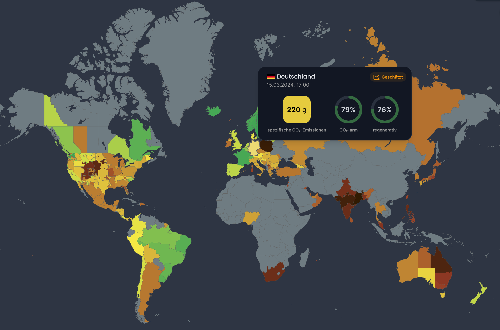
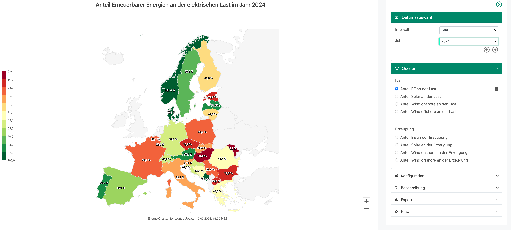

## CO2-Fussabdruck unseres Stroms

[https://app.electricitymaps.com](https://app.electricitymaps.com/) ist eine Webseite, die den CO2-Fussabdruck des Stromverbrauchs verschiedener Länder auf einer interaktiven Landkarte darstellt.

[https://www.energy-charts.info](https://www.energy-charts.info) ist eine Webseite, auf der viele interaktive Diagramme einsehbar sind.

